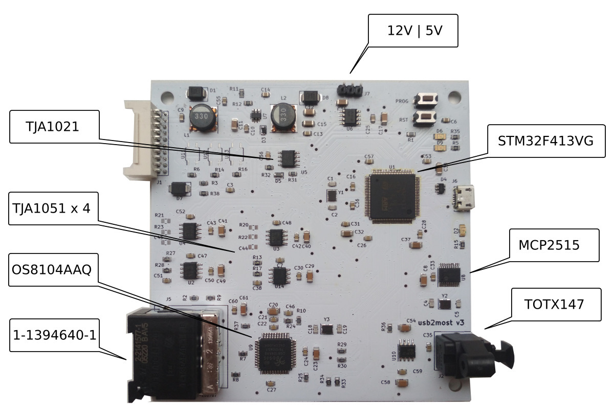

# usb2most
USB to MOST adapter to translate audio from a USB([UAC1](https://en.wikipedia.org/wiki/USB#Audio_streaming)) to MOST([Media Oriented Systems Transport](https://en.wikipedia.org/wiki/MOST_Bus)) bus

Interfaces:
- 8 audio channels(16bit/48kHz) over MOST bus
- 2 audio channels(16bit/48kHz) over USB
- 4 CAN for HS/HS" and MS/MS"
- 1 LIN for analogue watch
- 1 UART for CANBUS emulation

[More info](https://www.drive2.ru/l/524415370476389031/)

