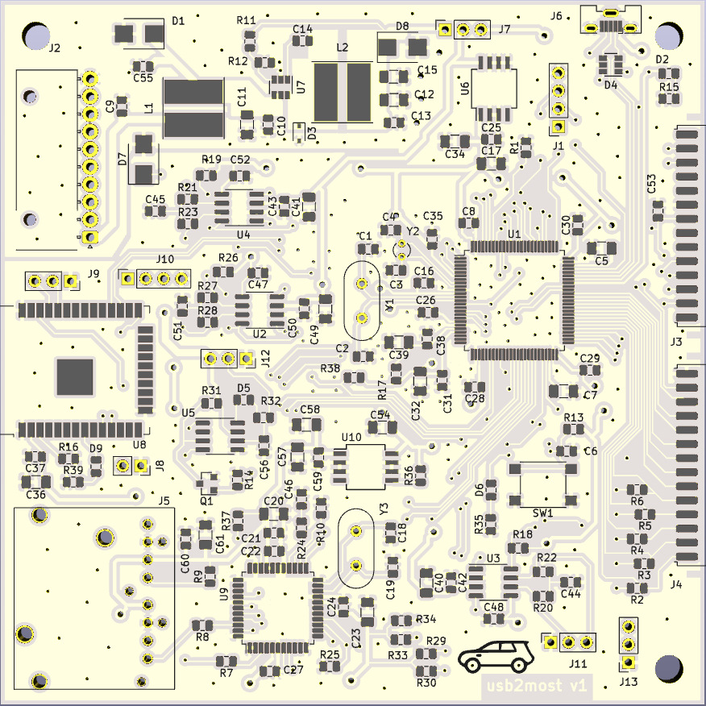

# usb2most
USB to MOST adapter to translate audio from a USB(UAC1) to MOST(Media Oriented Systems Transport) bus

Interfaces:
- 8 audio channels(16bit/48kHz) over MOST bus
- 6 audio channels(16bit/48kHz) over USB (stereo or 5.1 UAC1)
- 2 audio channes(16bit/48kHz) over bluetooth(A2DP)
- 3 CAN интерфейса, пара для HS и LS шин автомобиля и один интерфейс для панели управления магнитолы
- 1 LIN for watch
- 1 UART for CANBUS emulation
- 1 UART for bluetooth(RFCOMM)

[More info](https://www.drive2.ru/l/524415370476389031/)

